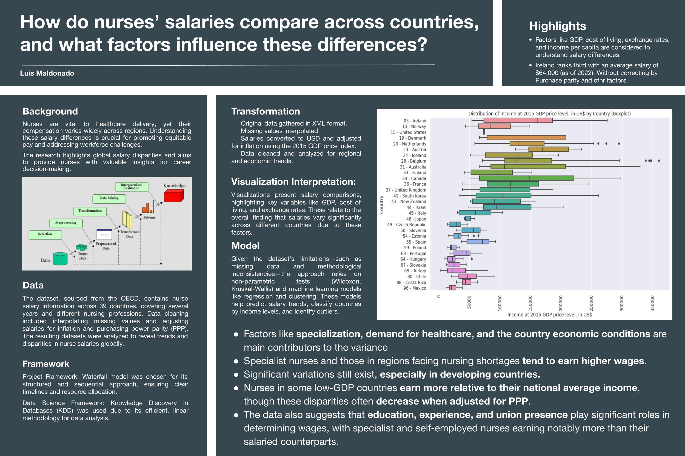
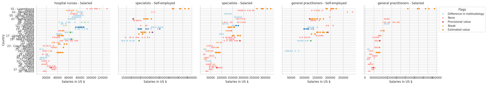
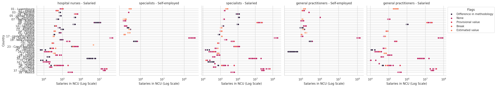
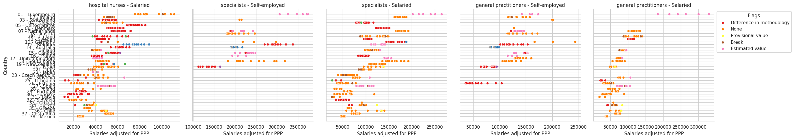
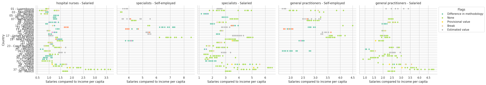
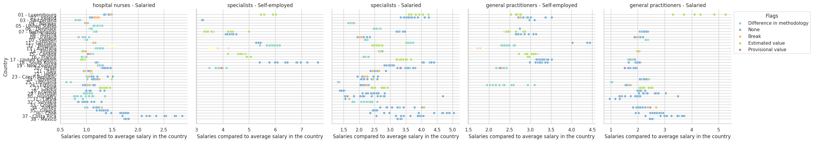
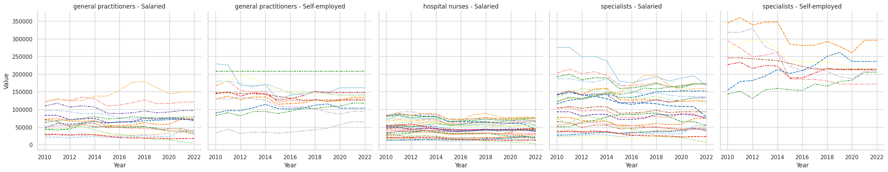
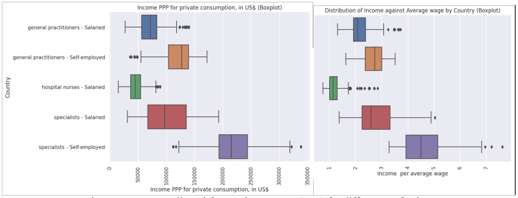
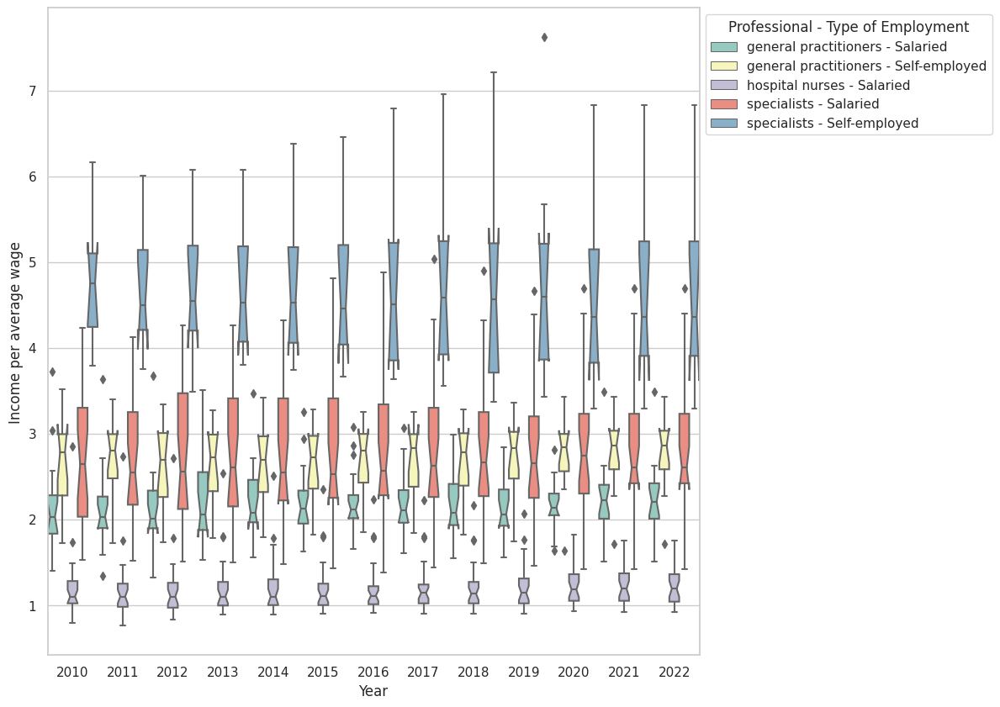

# Nurse Salaries Project

This research project aims to analyze the salaries of nurses in different countries before and after the pandemic. It aims to create an analytics tool to processes various datasets, generates reports, and visualizes the data trends to help HR teams make data-driven decisions about healthcare employment.

This project is important for making it visible the disparities in the compensation for healthcare workers, even trhough a worldwide crisis as the pandemic. It helps to visualize the trends in order to support the discussion about rising pay.

A key feature of the project is the iterative process in four phases.

The public repository of this project is available [Here](https://github.com/l-maldonado/Nurse_Salaries_Project)

## Table of Contents

- [Introduction](#introduction)
- [Structure](#structure)
- [Goals](#goals)
- [Problem](#problem)
- [Analysis](#analysis)
- [Discussion](#discussion)
- [License](#license)

## Introduction

This research examines nurses' salaries in Ireland compared to those in various countries, including Australia, Canada, the USA, and several European nations. The study factors in GDP, cost of living, exchange rates, and other variables to understand salary differences. In 2022, Ireland's average nurse salary was $64,000, ranking third among the countries studied. The paper also explores the evolving role of nurses in healthcare and highlights disparities in compensation despite their crucial role in patient care. The aim is to provide insights for nurses to make informed career decisions. The project follows the Waterfall model for structured project management and uses the Knowledge Discovery in Databases (KDD) framework for data analysis, with Jupyter Local chosen as the development environment.

Here is a Datafolio (Poster) report of the research process and takeaways:

## Structure

    /Nurse-Salaries-project
    ├── /data
    │ ├── HEALTH_REAC_.csv              # Raw OECD dataset
    │ ├── HEALTH_REAC_Interpolated.csv  # Cleaned dataset
    │ ├── HEALTH_REAC_Augmented.csv     # Enriched dataset
    │ ├── HEALTH_REAC_Sorted.csv        # Same dataset, ordered by country GDP
    │ ├── List of countries by GDP.csv  # ordered list of countries, to sort data.
    ├── /images
    │ ├── Boxplots and Facetgrids plots
    ├── /notebooks                      # JUPYTER Notebooks
    │ ├── 1. Data Preparation - Nurse Salary Project.ipynb
    │ ├── 2. Exploratory Data Analysis - Nurse Salary Project.ipynb
    │ ├── 3. Statistical Analysis - Nurse Salary Project.ipynb
    │ ├── 4. Machine Learning - Nurse Salary Project.ipynb
    ├── /src
    │ ├── preprocess.py                 # Data preprocessing scripts
    ├── FINAL REPORT - Nurse Salaries Project.pdf
    ├── Annex 1. Data Science project management methodologies.pdf
    ├── Annex 2 List of countries by GDp (nominal) - Wikipedia.pdf
    ├── Annex 3  List_of_countries_by_GDP_(nominal)_per_capita.pdf
    ├── Annex 4  List_of_countries_by_GDP_(PPP)_per_capita.pdf
    ├── Annex 5_ Nurse Salaries - Project Plan.docx
    ├── Annex 6_ Nurse salaries - Project Timeline.xlsx
    ├── README.md                       # Project documentation
    ├── requirements.txt                # Python dependencies
    ├── LICENSE.md                      # Project licencing

### Goals

The aim of this project is to establish a model of a complete software development cycle applied to a simple research project. This is the Capstone Project for the Master in Data Analytics of the University of Dublin.

The structure of the project is consisting in 4 main phases, each one deliverying specific types of insights:

1. Data Preparation
2. Exploratory Data Analysis
3. Statistical Analysis
4. Machine learning to answer research questions.

The idea is that the insights gathered in each phase inform the next, and eventually, the process turn iterative, since subsequent analysis and advancing with the research points the team to start working from scratch, or with the same supplies, but in a different direction.

This Git version controlled repository includes the notebooks that describe the four main phases of the project, as well as the documents that help shape the knowledge aquired about the topic of choice.

The complete datasets used were available publicly and without any license, from the OCDE website.

### Problem

The particular problem of choice is: "What are the characteristics of the salaries of nurses in the countries od the European Union, in particular in Ireland, from the data publicly available?". This project started during 2023 running experiments to gather data, transform it and test if it was feasible to answer business questions with it.

The initial idea was to build a data analysis tool that calculates and visualizes healthcare salary trends by processing datasets from different developed countries, generating reports, and applying statistics techniques and Purchasing Power Parity and cost of living adjustments to correct salary values. By accounting for economic factors, it provides a more accurate, less biased picture of salary changes over time and across a wide geography.

Then, after a lenghty analysis of the datasets, there were defined new descriptive variables in a **Feature Engineering** process that involved domain knowledge from the nursing field to generate new descriptors and classifiers. Using that information, a **Clustering Model** for countries were developed. And finally, many different **Machine Learning algorithms** were implmented using those new features in order to try to answer more difficult questions.

### Analysis

This report explores nurse salaries across 39 countries, using data from the OECD. The dataset, presented in XML format, lacked a dictionary and required research to interpret various variables and ranges. Assumptions were made regarding the dataset's source (OECD), consistency, and data privacy.
Key Data Findings and Dataset Issues:

- Missing Data: The dataset is incomplete, with missing values for self-employed nurses and some countries, years, and professions.
- Currency and Conversion: Salaries, reported in different currencies, were converted to USD and adjusted for inflation and purchasing power parity (PPP).
- Data Augmentation: Incomplete data was interpolated, and outliers were retained due to wide salary variation across countries.
- Two Datasets Created:
  - HEALTH_REAC_Interpolated.csv: Contains missing data with flags included.
  - HEALTH_REAC_Augmented.csv: Cleaned and enriched data with necessary adjustments.
- Methodological Inconsistencies: Flags indicate differences in data collection methods, complicating cross-country comparisons.
- Missing Data: Some professions, years, and countries have missing data, leading to incomplete analysis.
- Heteroscedasticity: The dataset exhibits non-homogeneous variance, complicating statistical analysis.

#### Exploratory Data Analysis (EDA):

- Nurse Salaries: Nurse salaries vary widely due to factors such as experience, education, employment type, and country.
- Regional Variations: Richer countries typically offer higher salaries, with a positive correlation between salary and GDP. Nurses in some developing countries (e.g., Latin America) earn relatively higher wages compared to the general population.
- Top-Paid Countries: Nurses in low-GDP countries may earn better than the national average. However, these disparities lessen when adjusted for PPP.
- Salary Evolution: Hospital nurse salaries have stagnated over the last 12 years, while salaries for general practitioners and specialists fluctuate depending on the country.
- Education & Experience: Nurses with more advanced qualifications (specialists) and self-employed nurses earn significantly more. Specialist nurses earn about 100% more than hospital nurses.
- Comparison to Other Healthcare Professionals: Hospital nurses earn about 1.2 times the national average, while general practitioners earn 2.5 times, and specialists earn 5.2 times the average salary.

##### Plots 1 to 5

How does different measurement methodologies, GDP ranking affect salaries of different professions.
Salaries are shown in these units:

- National Currency Units,
- Adjusted to the price of the dollar at 2015.
- Adjusted to Purchase parity prices
- compared to the GDP per capita
- compared to the average salary of the country.

#### Correlation and Statistical Analysis:

- Correlations: Many numerical variables, especially salaries and GDP, are correlated. However, deeper correlation analysis is limited due to the dataset's nature.
- Non-Parametric Tests: Since the dataset does not meet the assumptions for traditional statistical tests, non-parametric tests (Wilcoxon, Kruskal-Wallis) were used to confirm graphical trends.

Machine Learning Algorithms:

Several machine learning models were suggested for addressing analytical challenges:

- Income Prediction: Using linear regression, decision trees, and random forests to predict income based on variables like profession, country, and year.
- Country Classification: Classifying countries based on economic indicators and wages using methods like logistic regression, k-NN, and SVM.
- Outlier Detection: Using algorithms like Isolation Forest to identify outliers.
- Time Series Forecasting: Predicting trends in nurse salaries using ARIMA or Prophet.
- Cluster Analysis: Grouping countries or individuals based on income and economic indicators using clustering algorithms.

##### Plots 6

How have adjusted and standardized salaries varied over time?

#### Key Outcomes:

- Salary Differences Across Countries: Significant global salary variations are influenced by economic conditions, health policies, and the valuation of nursing as a profession.
- Salaries in Developed Countries: Nurses in developed nations tend to earn higher salaries, though some developing countries offer competitive wages.
- Experience and Qualifications: Most countries reward experience and qualifications with higher pay, aiming to retain skilled nurses.
- Demand-Driven Salaries: Countries with nursing shortages offer higher salaries to attract and retain nurses.
- Economic Disparities: Developing countries struggle to offer competitive wages, leading to nurse migration to wealthier nations.
- Cost of Living: The cost of living influences salary levels, requiring higher pay in areas with a higher cost of living.
- Cultural Valuation of Nursing: Countries with a higher social value for nursing tend to offer better compensation.
- Unionization: Strong nursing unions help negotiate better pay and benefits for nurses.

##### Plots 7

How are adjusted for PPP salaries compared among professions?

##### Plots 8

How are adjusted salaries compared to average salary of the country among professions?

#### Discussion:

The report identifies several factors influencing nurse salaries, such as specialization, demand, experience, and location. Specialist nurses with advanced training and more responsibilities earn higher wages. Countries facing nursing shortages or with strong unions tend to offer better compensation. Addressing salary disparities is vital to improving recruitment, retention, and job satisfaction in the nursing profession, ensuring a robust healthcare workforce globally.

## License

All rights reserved

No Use Without Permission

No Commercial Use

Modification Prohibited

Attribution must be made

See the [LICENSE](LICENSE.md) file for details.
